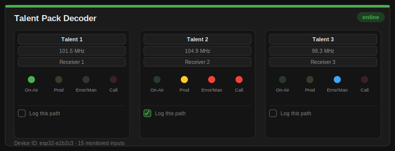

# ESP32 → Raspberry Pi GPIO Monitor (MQTT)

Multiple ESP32-Ethernet units each monitor a set of GPIO inputs (channel
count depends on the card type wired up — see "Card types" below) and
report their state over MQTT (DHCP-assigned IPs) to a Raspberry Pi, which
runs the MQTT broker plus a web dashboard showing each unit as a card.

```
[ESP32 #1] --Ethernet/DHCP--\
[ESP32 #2] --Ethernet/DHCP---> MQTT (Mosquitto on Pi) --> Flask dashboard/API
[ESP32 #N] --Ethernet/DHCP--/
```

## Project structure

```
esp32_firmware/
  _template/                          <- copy this to create a new device type
  device_type_1_talent_pack_decoder/  <- see the dedicated section below
raspberry_pi_server/                  <- the Pi's MQTT broker + dashboard (shared by every device type)
docs/
  ESP32-S3-ETH_Pinout.md              <- full board pinout reference
  talent_pack_decoder_card.svg        <- card render used in this README
```

Every device type shares the exact same networking/MQTT/discovery firmware
and the exact same Pi-side backend — adding a new one is mostly a matter of
picking pins and, optionally, a card layout. See
`esp32_firmware/_template/README.md` for the full workflow.

## 1. Raspberry Pi setup

### Quick install (recommended)

The installer pulls the project straight from GitHub, so you don't need to
copy files onto the Pi by hand. On a **brand new Pi**, run:
```bash
cd ~
git clone https://github.com/efife1/Equipment_Dashboard.git
cd Equipment_Dashboard/raspberry_pi_server
sudo bash install.sh
```
(Using `sudo bash install.sh` rather than `sudo ./install.sh` avoids a
"command not found" error — files uploaded through GitHub's web UI lose
their executable permission bit, so relying on it to run directly isn't
reliable. `bash install.sh` sidesteps that entirely.)

This one script handles everything:
- Installs Mosquitto (MQTT broker), configured to listen on all interfaces,
  and starts it
- Sets up **automatic DHCP detection/fallback** on the ESP32-facing
  interface (see "Network auto-config" below) — no manual IP planning
  needed, and safe to plug into any network without risking a conflict
- Installs Avahi and advertises the broker via mDNS (`_mqtt._tcp`) so ESP32
  units find it automatically
- Deploys the server code to `/opt/gpio-monitor`
- Creates a Python virtual environment and installs dependencies
- Installs a **systemd service** (`gpio-server`) so the server starts
  automatically on boot and restarts itself if it ever crashes
- Installs a global **`EQ-update`** command (see below) for one-word future updates
- Prints the dashboard URL when done

**Deploying updates later:** push your changes to GitHub, then run:
```bash
sudo EQ-update
```
That's it — `EQ-update` is installed automatically the first time
`install.sh` runs, and works from any directory after that (it's just a
thin wrapper that re-runs `install.sh` with the latest code, so there's
only one place that actually knows how to install/update anything). It
pulls the latest commit and restarts the service. Your commissioning
registry (`registry.json`) and card types (`device_types.json`) aren't
tracked by git, so they survive updates untouched.

If you'd rather not rely on the global command, the equivalent manual
steps still work too:
```bash
cd ~/Equipment_Dashboard/raspberry_pi_server
git pull
sudo bash install.sh
```

**If a previous/different install is already on this Pi:** clear it out
first so nothing conflicts with the fresh install:
```bash
sudo systemctl disable --now gpio-server 2>/dev/null
sudo rm -rf ~/Equipment_Dashboard /opt/gpio-monitor
```
then run the quick install steps above.

> **Note:** `install.sh` assumes the repo keeps these server files in a
> `raspberry_pi_server/` subfolder, matching this project's layout. If your
> repo's structure is different, edit the `REPO_SUBDIR` variable near the
> top of `install.sh` to match (set it to `""` if the files sit at the repo
> root instead).

Once installed, manage it with:
```bash
sudo EQ-update                        # pull + deploy the latest from GitHub
sudo systemctl status gpio-server     # check status
sudo journalctl -u gpio-server -f     # live logs
sudo systemctl restart gpio-server    # restart
```

### Manual install (if you'd rather do it step by step)

Install the MQTT broker:
```bash
sudo apt update
sudo apt install -y mosquitto mosquitto-clients
sudo systemctl enable --now mosquitto
```

Advertise the broker on the network via mDNS so ESP32 units can find it
automatically (Raspberry Pi OS ships with Avahi already running, so this is
just adding a service definition):
```bash
cd raspberry_pi_server
sudo cp mqtt.service /etc/avahi/services/mqtt.service
sudo systemctl restart avahi-daemon
```

Verify it's visible on the network from another machine:
```bash
avahi-browse -r _mqtt._tcp      # Linux
dns-sd -B _mqtt._tcp            # macOS
```

Install Python dependencies and run the server:
```bash
pip install -r requirements.txt
python3 gpio_server.py
```
Run it manually like this whenever you want, or install it as a persistent
service yourself — `gpio-server.service` (included) is the same systemd unit
`install.sh` sets up, if you'd rather wire it up by hand instead of running
the full script.

- Dashboard: `http://<pi-ip>:8080`
- Raw JSON:  `http://<pi-ip>:8080/api/devices`

The server needs no per-device configuration — any ESP32 that publishes to
`gpio/<device_id>/status` shows up automatically.

## 2. Network auto-config: DHCP detection with fallback

Rather than assuming a DHCP server is present (a router) or hardcoding a
static IP that risks colliding with something already on your network, the
installer sets up `network-autoconfig.sh` to handle this automatically on
the interface the ESP32 units connect to (`TARGET_IFACE`, default `eth0` —
edit that variable near the top of `install.sh` if yours is named
differently, e.g. `end0` on some Pi models).

**What it does, every time it runs:**
1. Sends a real DHCP discover probe on that interface and waits briefly for
   a response.
2. **If a DHCP server answers** (e.g. this segment turns out to have a
   router after all): the Pi configures itself as a normal DHCP client and
   makes sure it is *not* also handing out addresses — avoiding ever
   becoming a second, conflicting DHCP server.
3. **If nothing answers** (an isolated switch with no router, like this
   project was built for): the Pi assigns itself a fixed fallback address
   (`10.42.0.1/24` by default) and starts serving DHCP itself — but strictly
   on that one interface/segment, never routed or bridged anywhere else.

**This re-runs automatically**, not just at boot — a NetworkManager
dispatcher hook re-triggers it any time that interface's link state
changes (cable plugged in, moved to a different switch, etc.), so nothing
needs to be reconfigured by hand if the Pi ends up on a different network
later.

You can also trigger it manually any time:
```bash
sudo /opt/gpio-monitor/network-autoconfig.sh eth0
```
Logs from the automatic (dispatcher-triggered) runs go to
`/var/log/gpio-monitor-net.log`.

**Avoiding collisions:** if `10.42.0.0/24` happens to already be in use
somewhere reachable from this segment, edit `FALLBACK_IP`/`FALLBACK_CIDR`
near the top of `network-autoconfig.sh` to a range that's clear on your
network, then re-run it (or push the change to GitHub and re-run
`install.sh`).

> **Requires NetworkManager** (the default on Raspberry Pi OS Bookworm and
> newer). If your Pi uses the older dhcpcd/ifupdown stack instead, the
> installer will detect that, skip this feature, and tell you — in that
> case, either plug into a network with an existing DHCP server, or set up
> a manual `dnsmasq`-based DHCP server yourself for that interface.

## 3. ESP32 client setup

1. In Arduino IDE, install board support: **Boards Manager → esp32 (Espressif Systems)**, version 2.0.12+.
2. Install libraries: **PubSubClient** and **ArduinoJson** (Library Manager). (**ESPmDNS** and **SPI** ship with the ESP32 core, no separate install needed.)
3. Open the `.ino` inside the `esp32_firmware/device_type_N_.../` folder
   matching the device you're flashing. (Building a new device type?
   Start from `esp32_firmware/_template/` instead — see its `README.md`.)
4. Board settings — this firmware targets the **Waveshare ESP32-S3-ETH** (onboard W5500 Ethernet over SPI):
   - **Tools → Board → esp32 → "ESP32S3 Dev Module"** (not plain "ESP32 Dev Module" — picking the wrong one causes an upload error like `This chip is ESP32-S3, not ESP32`)
   - **Tools → USB CDC On Boot → Enabled** (needed for Serial Monitor over this board's USB-C port)
5. The **GPIO_PINS** array near the top is already set correctly for
   whichever device type's folder you opened — no broker address needed
   either, since it's discovered automatically via mDNS (see below).
6. Upload — this same firmware/config works unmodified on every unit *of
   that device type*, since nothing device- or network-specific is
   hardcoded. Different device types run different `.ino` files (each with
   their own pin layout), but every unit of the same device type runs the
   exact same one.
7. Open Serial Monitor (115200 baud) to confirm it gets a DHCP address, finds the broker, and connects to MQTT.

Repeat for each unit — no code changes needed between units of the same
device type beyond confirming the board type; each one auto-generates a
unique device ID from its MAC address (or set `DEVICE_NAME` for a fixed
human-readable name instead).

### GPIO pin availability

This firmware targets the **Waveshare ESP32-S3-ETH**, which uses an onboard
W5500 chip over SPI for Ethernet (not the RMII/LAN8720 hardware other ESP32
Ethernet boards use). Its SPI bus and control pins are fixed by the board:
MISO=12, MOSI=11, SCLK=13, CS=14, RST=9, INT=10.

The board only exposes a limited set of pins beyond that — GPIO33–37 are
permanently reserved internally for PSRAM on this board's ESP32-S3R8 (per
Waveshare's own FAQ, not usable regardless of what other pinout charts
show), GPIO19/20 are the native-USB D-/D+ pins, and GPIO0/3/45/46 are
boot-strapping pins best avoided (GPIO45 especially, since it selects the
flash's operating voltage at boot). That leaves about 16 pins that are
genuinely safe to use, split by physical header side on this board (see
`docs/ESP32-S3-ETH_Pinout.md` for the complete reference):

- **Left header:** 1, 2, 15, 16, 17, 18, 21
- **Right header:** 38, 39, 40, 41, 42, 43, 44, 47, 48

Each device type's own folder documents exactly which of these it uses and
why (see that device type's section further down for the specifics). If
you also plan to use this board's onboard TF card slot (GPIO4–7) or camera
header for something, pick different signal pins for those, since a device
type's channels may otherwise overlap with that range.

## 4. Network notes

- All units use **DHCP** — no static IP config needed on the ESP32 side.
- The Pi's MQTT broker is found via **mDNS/Zeroconf** (`_mqtt._tcp` service
  advertised by Avahi) — no IP hardcoded on the ESP32 side either. This
  means the firmware is identical across every unit and units are fully
  interchangeable; swap one in and it finds the network's broker on its own.
- If the Pi's DHCP lease changes IP later, each ESP32 re-runs discovery on
  every MQTT reconnect attempt, so it picks up the new address automatically
  without a reflash.
- **Crossing VLANs/subnets:** mDNS relies on multicast traffic reaching both
  devices, so it works cleanly on a flat LAN but typically won't cross
  routed boundaries on its own. The firmware automatically falls back to a
  plain unicast DNS lookup (`MQTT_BROKER_HOSTNAME`, default
  `raspberrypi.lan`) if mDNS finds nothing — unicast DNS routes across
  VLANs like any other query, no reflector needed. To make the fallback
  actually resolve, do one of:
  - Give the Pi a DHCP reservation and confirm your router auto-registers
    DHCP client hostnames in its local DNS (many consumer/prosumer routers
    do this — check its "clients" or "DHCP leases" page for a hostname you
    can query), or
  - Add a manual local DNS A record for `raspberrypi.lan` pointing at the
    Pi's reserved IP (pfSense/OPNsense, Pi-hole, or your DNS server's admin
    page), or
  - Set up an **mDNS reflector** instead if your router/L3 switch supports
    one (e.g. UniFi's "mDNS Gateway" toggle, or `avahi-daemon-reflect` on a
    Linux router) — then mDNS itself crosses VLANs and the DNS fallback
    never even gets used.
  Any one of these is enough; the firmware doesn't need to be touched
  either way once one is in place.
- For predictability, you can still set a **DHCP reservation** for each
  ESP32's MAC on your router if you want consistent IPs for troubleshooting
  — it's optional now, since neither side depends on a fixed address.

## 5. Commissioning devices (MAC → equipment name) and card types

Each ESP32 reports its full MAC address in every MQTT message. The Pi keeps
a persistent registry (`raspberry_pi_server/registry.json`, created
automatically) mapping MAC addresses to equipment names, so the dashboard
shows *"Compressor Panel 3"* instead of a bare device ID — rendered as a
card in a grid, not a table row.

**Card types** (`raspberry_pi_server/device_types.json`, up to 32 slots)
control how each device's card is drawn. Most types use the **generic
layout**: a name, an accent color, and a label for each monitored GPIO
channel (e.g. *"Pump Running"* instead of *"GPIO 0"*). A device with no
type assigned still works fine — its card just falls back to generic
"GPIO 0", "GPIO 1", etc. Manage all types at `http://<pi-ip>:8080/device-types`.

Slot 1 is reserved for the built-in **Talent Pack Decoder** layout — see
its own dedicated section below for what it looks like and how it works.
Any other slot you define uses the generic layout described above unless
you add a bespoke renderer for it (see
`esp32_firmware/_template/README.md` for that workflow).

### Dashboard display controls

Two per-browser display preferences (remembered via the browser, not
shared server-side): a **"Hide offline devices"** checkbox in the filter
bar hides any card that isn't currently online, and every card has a small
**×** button to hide that specific card manually — a "N card(s) manually
hidden — show all" link appears whenever any are hidden, so nothing's
permanently lost.

### Commissioning a new unit

1. Power it on and let it connect — it'll show up on the dashboard as an
   *"unregistered"* card along with its MAC address.
2. Click **"register it"** on that card (or go to `http://<pi-ip>:8080/commission`
   and enter the MAC manually — also printed in Serial Monitor on boot).
3. Fill in the equipment name, pick a **card type** from the dropdown
   (defining a new one first via the link on that page if needed), and
   optionally a location and notes.
4. Save — the dashboard updates immediately, and both the equipment
   mapping and card type assignment persist across server restarts.

You can also view/edit/delete existing entries at `/commission`, view/edit
card types at `/device-types`, or pull any of this as JSON from
`/api/registry`, `/api/device-types`, or `/api/devices`.

## 6. Device Type 1: Talent Pack Decoder



The Talent Pack Decoder card monitors 3 broadcast decoder units at once,
each shown as its own panel on the card. It's the one built-in "special"
card layout in this project (every other card type uses the simpler
generic per-GPIO label grid described above).

**What each part does:**

- **Name / Frequency / Receiver fields** — three free-text fields per
  decoder, editable right on the card. Type into any of them and it saves
  automatically after a brief pause — no save button, no page reload.
  These are per-decoder labels you assign (e.g. talent name, station
  frequency, receiver number); they're not read from the hardware.
- **On-Air LED (green)** — lit when that decoder's On-Air input is active.
- **Prod LED (yellow)** — lit when that decoder's Prod input is active.
- **Error/Manual LED (two-way)** — a single indicator driven by 2 GPIO
  pins: lights **red for Error**, **blue for Manual**, or stays dark if
  neither is asserted.
- **Call LED (red)** — lit when that decoder's Call input is active.
- **"Log this path" checkbox** — sits below the LEDs. When checked, every
  On-Air/Prod state change on that specific decoder is written to a daily
  CSV log (see "Event logging" below). Unchecked by default — nothing is
  logged unless you opt in.

All LED states update live via the dashboard's background poll (every 3
seconds) without ever interrupting whatever you're typing into the text
fields above them.

**Wiring:** 5 GPIO channels per decoder, 15 total, in this fixed order
(`GPIO_PINS[]` in
`esp32_firmware/device_type_1_talent_pack_decoder/esp32_gpio_client.ino`)
— grouped by physical header side on the Waveshare ESP32-S3-ETH for easier
wiring:

| Decoder | On-Air | Prod | Error/Manual A | Error/Manual B | Call | Header side |
|---|---|---|---|---|---|---|
| 1 | GPIO1 | GPIO2 | GPIO15 | GPIO16 | GPIO17 | Left |
| 2 | GPIO18 | GPIO21 | GPIO38 | GPIO39 | GPIO40 | Left (18, 21) / Right (38, 39, 40) |
| 3 | GPIO41 | GPIO42 | GPIO47 | GPIO48 | GPIO43 | Right |

(Decoder 2's first two channels land on the last two free left-side pins
since the right header only has 9 safe pins total for 10 needed across
Decoders 2 and 3 combined — see "GPIO pin availability" above for the full
safe-pin breakdown by side.)

**Event logging:** view or download logs at `http://<pi-ip>:8080/logs`,
which lists available dates and shows timestamp, equipment, decoder name,
channel, and state (ON/OFF) for whichever day you select — or grab the raw
CSV via the download link on that page. One file per calendar day, kept
for 30 days automatically before being deleted.

## 7. How offline detection works

- Each ESP32 sets an MQTT **Last Will** message (`offline`) that the broker
  publishes automatically if the connection drops uncleanly.
- Each ESP32 also publishes a heartbeat at least every 5 seconds (configurable
  via `PUBLISH_INTERVAL_MS`), even with no GPIO changes.
- The Pi server also independently marks a device **stale** if it hasn't
  heard from it in `STALE_TIMEOUT_SEC` (default 30s) — a backstop in case a
  device loses power abruptly and the LWT doesn't arrive in time.

## 8. Troubleshooting

**`sudo: ./install.sh: command not found`** — run `sudo bash install.sh`
instead. Files uploaded through GitHub's web interface lose their
executable permission bit, so `./install.sh` (which relies on that bit)
fails even though the file is right there; `bash install.sh` runs it
regardless of permissions.

**`sudo: EQ-update: command not found`** — `EQ-update` is only installed
after `install.sh` has been run at least once (it copies itself to
`/usr/local/bin/EQ-update` during install). If you haven't done the full
install yet on this Pi, run the Quick install steps above first; after
that, `EQ-update` works from anywhere.

**Wrong content after cloning / unexpected service name in the install
output** — double check `github.com/efife1/Equipment_Dashboard` actually
contains this project's files (an `esp32_firmware/` folder and a
`raspberry_pi_server/` folder with `gpio_server.py`, `install.sh`, etc. in
it) before running the installer. If the repo was previously used for
something else, clear out any stale install first:
```bash
sudo systemctl disable --now <old-service-name> 2>/dev/null
sudo rm -rf ~/Equipment_Dashboard /opt/gpio-monitor
```
then re-clone and run `sudo bash install.sh` again.

**`fatal: could not create work tree dir` when re-cloning** — this happens
if your terminal's current directory is *inside* the folder you're trying to
delete/recreate. Run `cd ~` first, then the cleanup and clone commands.

**ESP32 Serial Monitor gets stuck repeating "ETH Connected (link up)" and
never prints "got IP via DHCP"** — this means the physical link is fine but
DHCP itself never completes, which happens on an isolated switch with no
router/DHCP server present. The fix is on the Pi side, not the ESP32:
confirm `network-autoconfig.service` ran successfully
(`sudo journalctl -u network-autoconfig -n 30`) and that the Pi picked up
its fallback address (`ip -4 addr show eth0`). If it's still not handing
out leases, try re-running it manually:
`sudo /opt/gpio-monitor/network-autoconfig.sh eth0`.
